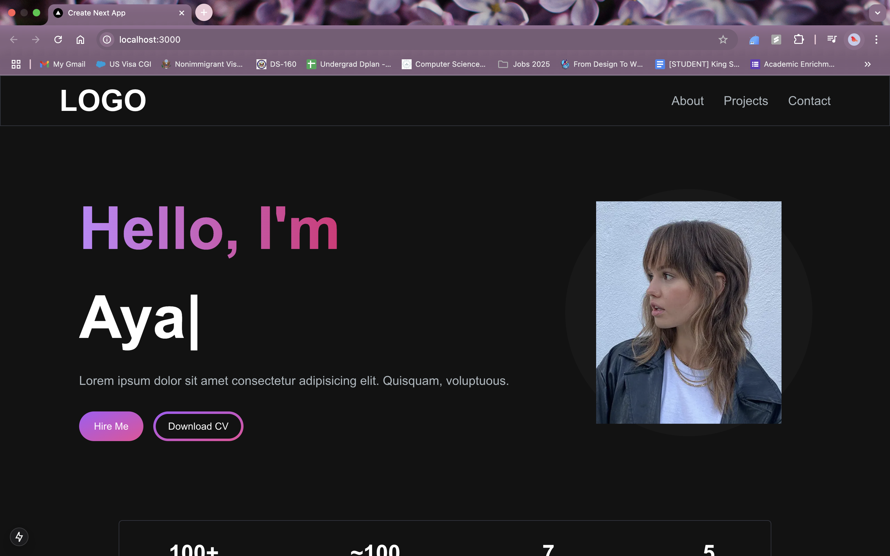
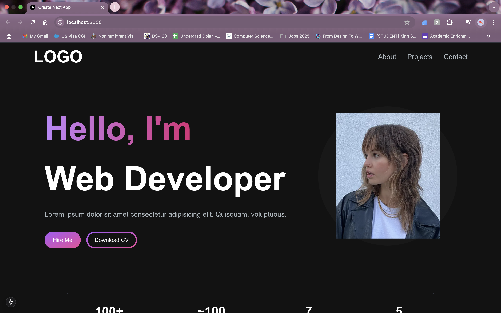
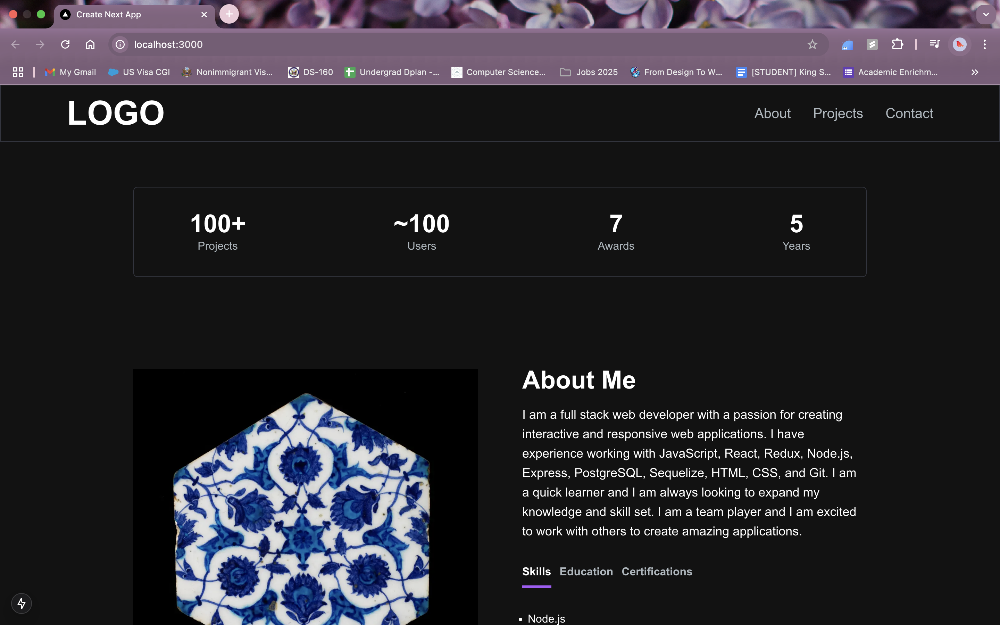
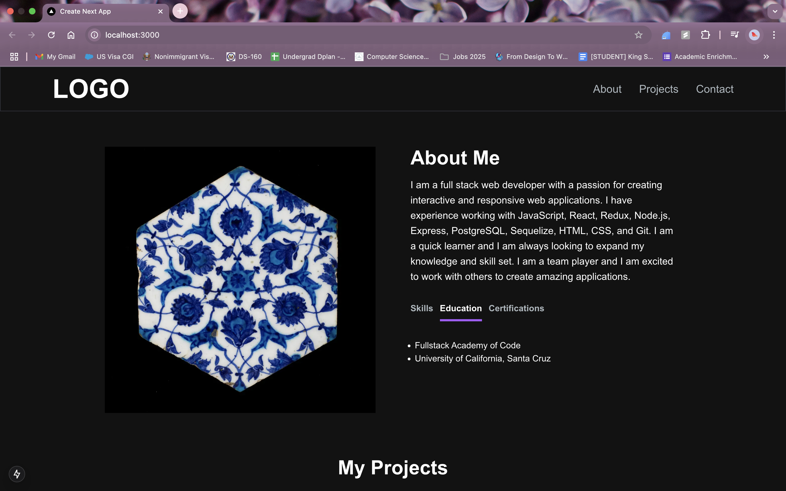
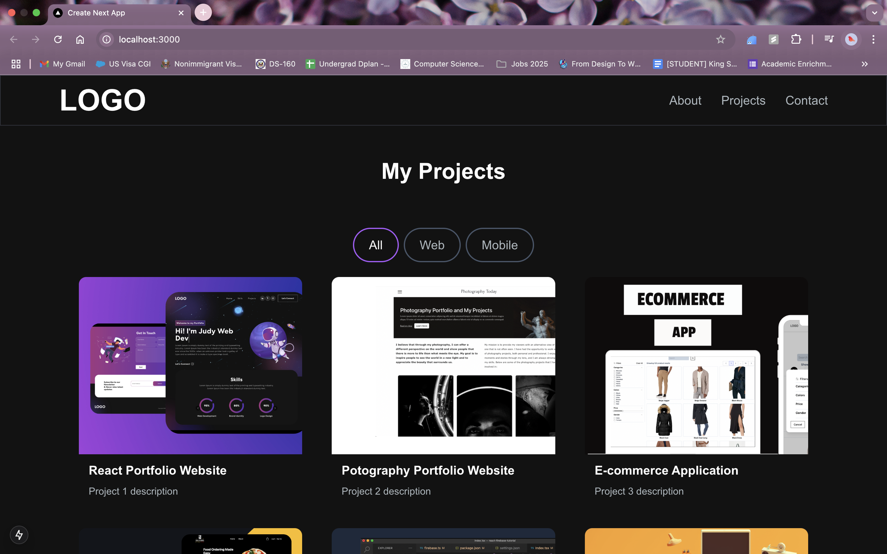
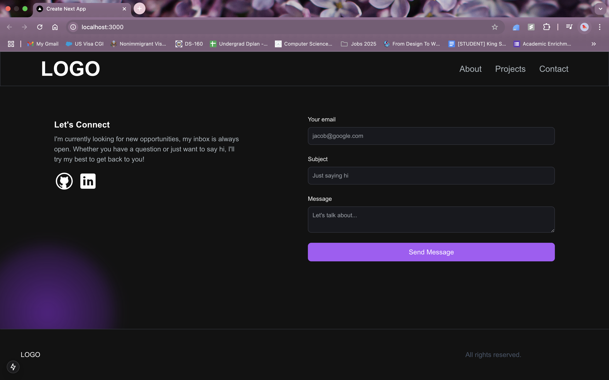

# Portfolio Website: Next.js, Tailwind, Animations, and Email APIs

## What you built? 

I built a personal portfolio websites using Next.js, tailwind css, advanced animations, and gmail API.

## Who Did What?

I worked on the whole project individually.

## What you learned

Working with email APIs took several tries before success. At first, I was using the Resend API, but then it turned out that I needed to have my own domain, which I do not. Then, I decided to switch and try the gmail API, which eventually worked. The only thing that I still need to figure out when a client sends an email through my portfolio website that their name pops up correctly in the email I received. So far, if I receive an email from example@gmail.com, it shows that their name is example, meaning that it is the first half of the email address, which is not always the case. I need to look further into that.

## Authors

Aya Hajjeh

## Acknowledgments

Tutorials below immensely helped work on my portfolio website, especially the first one.
- [Portfolio Website Tutorial](https://www.youtube.com/watch?v=Kb1f5bvF6f4)
- [Resend API Tutorial](https://www.youtube.com/watch?v=fEeksraKfJI)
- [Gmail API Tutorial](https://www.youtube.com/watch?v=oujAYWgYwtM)
